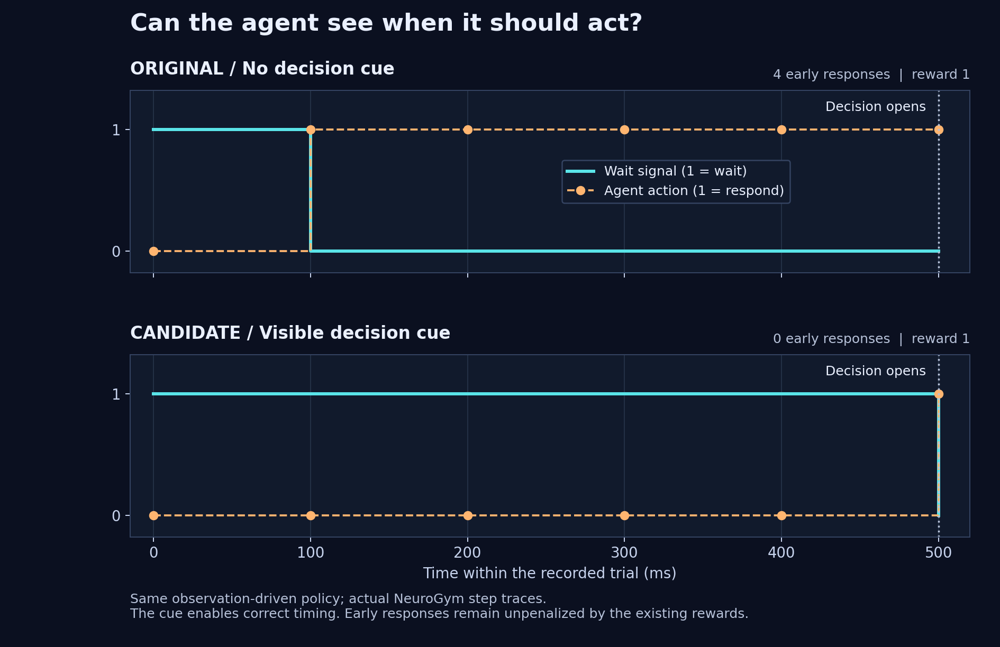

# NeuroGym: a visible signal for when to act

We reproduced a real ambiguity in [NeuroGym issue #279](https://github.com/neurogym/neurogym/issues/279)
and built a narrowly scoped candidate fix. The task could require different
answers after identical visible histories. The correction keeps its existing
fixation signal on until the decision period begins.

**Status (10 September 2026):** submitted as [PR #295](https://github.com/neurogym/neurogym/pull/295),
open and awaiting maintainer review; not merged. Local tested commit `279e434a62a82fd7ef2765f00976aad41fa6fd57`
and submitted head `4109acb28faa75919096a8765879289304ce9417` contain byte-identical
committed blobs for both changed files. Upstream acceptance and compatibility
decisions remain open. The PR shows current checks and review status.

| Executed check | Original | Candidate |
| --- | ---: | ---: |
| Ambiguous delay/decision pairs across four task variants | 4 of 4 | 0 of 4 |
| Early responses by the same observation-driven policy, per rollout | 4 | 0 |
| Reward per diagnostic rollout | 1 | 1 |
| New regression cases passing | 12 of 32 | 32 of 32 |

**What researchers gain.** The intended response time becomes observable. That
removes a source of ambiguity in training labels and lets an agent use the
actual wait/go signal. The 32 regression cases protect variable-delay timing,
explicit and implicit contexts, both modalities, ring sizes, zero/quantized
delays, public-step alignment and existing reward behavior.

The original code already passed its 21 task tests. Our 20 failing cue cases
therefore expose a gap in the existing coverage. All **132 tests** in the full
candidate suite passed, with genuine Stable-Baselines3/SB3-Contrib dependencies
present so the activation-monitor test executed its optional model path.
Repository-wide Ruff lint and formatting pass; mypy checks 103 source files;
both wheel and source distribution build and contain the tested implementation.
The new regression file is included in the patch and evidence package; the
project's existing source-distribution configuration excludes its tests.

**What stayed the same.** A separate capture compared 240 noisy seeded trials
across 12 context/modality/ring configurations. Non-fixation observations are
byte-identical. Trial draws, targets, shapes and sampled timings also match.
Only the intended fixation values change. The four diagnostic rollouts use the
same simple observation-driven policy, not a newly trained network.

**Why this is meaningful.** A learner cannot reliably infer which of two
identical observed histories secretly has a different current target. Exposing
the missing event makes the benchmark's intended timing available to the
learner. This is a practical application of checking whether observations carry
the information a task demands. It is established task-design reasoning applied
to a concrete open problem, not proof of the broader framework or an AI advance.

**Limits.** The cue makes waiting possible; existing reward rules still ignore
premature actions during stimulus and delay, even with `abort=True`. A different
policy can still exploit those rules. The fix does not enforce all aspects of
biological saccade timing. This is a finite controlled-trial diagnostic using
`new_trial`, the initial observation and public `step`, not an LSTM training
study or a reproduction of the complete Mante experiment. Validation used one
Windows/Python 3.12.14 runtime, with NumPy 2.2.6, Gymnasium 0.29.1, Matplotlib
3.10.9 and CPU PyTorch 2.14.0. Type checking used the repository's Python 3.11
target with compatible scipy-stubs 1.17.1.5 and optype 0.17.1.

**Upstream path.** [PR #206](https://github.com/neurogym/neurogym/pull/206)
introduced the fixation restriction; [#285](https://github.com/neurogym/neurogym/pull/285)
later changed the example notebook. Correcting the cue changes inputs seen by
existing policies, so maintainers should choose the release/compatibility policy.
The submitted PR presents this as a concrete proposal for that discussion,
with the patch, tests and executed evidence available for review.

[Validation manifest](NeuroGym_Validation.json) · [Patch](NeuroGym_Go_Cue.patch)
· [Complete evidence package](NeuroGym_Contribution_Package.zip)
